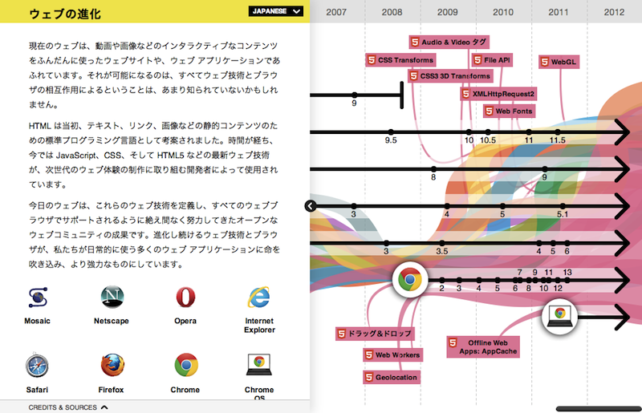

# Familiar HTML5
### 事例とサンプルコードから学ぶ 身近で普通に使わているHTML5
### <a href="http://html5miyazaki.org/" target="_blank">HTML5 Conference Miyazaki 2013</a> 2013/01/31

<a href="http://sadah.github.com" target="_blank">ひらい さだあき</a> / <a href="http://twitter.com/sada_h">@sada_h</a>

## ひらい さだあき
* html5j.org / HTML5とか勉強会 スタッフ
* <a href="http://sadah.github.com" target="_blank">sadah.github.com</a> / <a href="http://twitter.com/sada_h" target="_blank">@sada_h</a> / <a href="http://d.hatena.ne.jp/j7400157" target="_blank">techlog</a>
* Kamakura, Born in 1981.
* Ruby / Rails / HTML5 / JavaScript / Java
* Kakaku.com, Inc. Engineer
    * <a href="http://tabelog.com/" target="_blank">グルメ・レストランガイド [食べログ]</a>
    * <a href="http://yoyaku.tabelog.com/" target="_blank">レストラン予約サイト [cena(チェーナ)]</a>

**この資料の内容は私の個人的な見解であり 所属する会社の公式見解ではありません。**

**仕事をしながら考えること**

**HTML5、どこから、なにから使う？**

## HTML5はW3C勧告候補
<table>
  <tr> <th>Year <th>Spec <th>Topic
  <tr> <td>1993 <td>HTML 1.0<td>IEFT標準化
  <tr> <td>1997 <td>HTML 3.2 <td>W3C勧告 W3Cではじめての勧告
  <tr> <td>1997 <td>HTML 4.0 <td>W3C勧告
  <tr> <td>1999 <td>HTML 4.0.1<td>W3C勧告
  <tr> <td>2000 <td>XHTML 1.0 <td>W3C勧告 HTML 4.0.1をXMLで再定義
</table>

## HTML5はW3C勧告候補
<table>
  <tr> <th>Year <th>Spec <th>Topic
  <tr> <td>2001 <td>XHTML 1.1 <td>W3C勧告 機能をモジュール化
  <tr> <td>2007 <td>HTML5 <td>W3Cで検討開始(WG設立)
  <tr> <td>2009 <td>XHTML 2.0 <td>XHTML2 WG 活動停止
  <tr> <td>2011 <td>HTML5 <td>W3C 最終草案
  <tr> <td>2012 <td>HTML5 <td>W3C 勧告候補 (2012/12/17)
</table>

## ウェブの進化

<aside class="notes">
<a href="http://www.dotcominfoway.com/blog/dot-com-infoway-releases-html5-infographic" target="_blank">Dot Com Infoway Releases HTML5 Infographic</a>
<a href="http://www.wix.com/flash/infographic/the-history-of-html5.html" target="_blank">The History of HTML5</a>
</aside>

**たくさんある。**

## HTML5をどこから使う？
* キャンペーンサイト
* 新しく立ち上げるサイト
* スマートフォン向けサイト

**勧告候補になったし そろそろ普通に使っていきたい**

**どこから、なにから使えばいいのか？**

**すでにHTML5を使っているサイトを参考に HTML5を取り入れて行きたい。**

**いろいろな事例を調べて、考えてみた。 ↑これから話すこと**

**身近な、普通のサイトで使う(使われている)HTML5**

## HTML5 Markup
HTML5なマークアップはけっこう見かける。

* <a href="http://www.muji.net/" target="_blank">無印良品</a>
* <a href="http://www.apple.com/" target="_blank">Apple</a>
* <a href="http://www.lawson.co.jp/index.html" target="_blank">マチのほっとステーション LAWSON｜ローソン</a>
* <a href="http://www.united-arrows.co.jp/index.html" target="_blank">ユナイテッドアローズ公式サイト｜UNITED ARROWS LTD.</a>
* <a href="http://www.beams.co.jp/" target="_blank">BEAMSオフィシャルサイト｜ビームス</a>

spec

* <a href="http://www.w3.org/TR/html5/" target="_blank">HTML5</a> / <a href="http://www.w3.org/TR/html51/" target="_blank">HTML 5.1</a>

## HTML5 Markup
まずは doctype を書き換えて、フォールバックを入れておくのはいいかも。

    <!--[if IE]><![endif]-->

    ["abbr", "article", "aside", "command", "details", "figcaption", "figure", "footer", "header", "hgroup", "mark", "meter", "nav", "output", "progress", "section", "summary", "time"]
    document.createElement(e)

    "abbr,article,aside,audio,canvas,datalist,details,eventsource,figure,footer,header,hgroup,mark,menu,meter,nav,output,progress,section,time,video"

## JavaScript
windowオブジェクトはHTML5で定義された。

Thanks myakura!

* <a href="http://www.w3.org/TR/html5/browsers.html#the-window-object" target="_blank">5.2 The Window object — HTML5</a>

Selectors APIはjQueryを使えば使ってる。

* <a href="http://www.w3.org/TR/selectors-api/" target="_blank">Selectors API Level 1</a>

ま、もっといろいろあるのは分かるけど、身近なものってことで。

## WebStorage
WebStorage は Google や twitter で使われてる。

* <a href="https://twitter.com/" target="_blank">Twitter</a>
* <a href="http://www.google.co.jp/" target="_blank">Google</a>
* <a href="http://www.w3.org/TR/webstorage/" target="_blank">Web Storage</a>

普通のサイトではあまり見かけなかった。Cookieの代わりに使えたりするけど、フォールバックがちょっと面倒なのかな？

ちゃんと IndexedDB を使ってるサイトは見つけられなかった＞＜

HTML5Rocksのサンプルなら…。

* <a href="http://www.html5rocks.com/ja/tutorials/indexeddb/todo/" target="_blank">HTML5 の IndexedDB を使用した簡単な TODO リスト - HTML5 Rocks</a>

## CSS3
border-radius とか text-shadow はいろいろなサイトで使われてる。<a href="http://yoyaku.tabelog.com/" target="_blank">cena(チェーナ)</a>でも使ってる。積極的に使っていきたい。animationとかは、使わないけど。

* <a href="http://www.modern.ie/" target="_blank">Home | Testing made easier in Internet Explorer | modern.IE</a>
* <a href="http://www.browserstack.com/start" target="_blank">Dashboard</a>
* <a href="http://www.browserstack.com/" target="_blank">BrowserStack Cross Browser Testing Tool. 100+ Browsers, Mobile, Real IE.</a>
* <a href="https://browserlab.adobe.com/ja-jp/" target="_blank">Adobe® BrowserLab</a>

## MediaQueries
たくさん見かける、見つかる。

* <a href="http://www.w3.org/" target="_blank">World Wide Web Consortium (W3C)</a>
* <a href="http://sadah.github.com" target="_blank">sadah.github.com</a>
* <a href="http://www.microsoft.com/ja-jp/default.aspx" target="_blank">日本マイクロソフト│Microsoft Japan</a>
* <a href="http://www.nttdata.com/jp/ja/index.html" target="_blank">NTTデータ</a>
いろいろ。
* <a href="http://mediaqueri.es/" target="_blank">Media Queries</a>
* <a href="http://lab.maltewassermann.com/viewport-resizer/" target="_blank">Responsive design testing tool – Viewport Resizer – Device simulation tool</a>

## MediaQueries
サイトをリニューアルするときは検討してもいいかも。

僕のシンプルなサイトでさえ、確認が大変でちょっと泣けた。CSS力が低いせいもあるけど。

コーポレートサイトや、静的なサイトにはいいかも。

食べログのようなWebアプリケーションには向かないかも。PCとスマホで必要となる機能が違うから。

PCとスマホで利用シーンが全く異なる。

## WebFonts
普通に使ってるサイトがたくさん。見つけるのはちょっと大変だけど、DevToolsを開くとすぐに分かる。

* <a href="http://www.beams.co.jp/" target="_blank">BEAMSオフィシャルサイト｜ビームス</a>
* <a href="http://www.nttdata.com/jp/ja/index.html" target="_blank">NTTデータ</a>
* <a href="http://webfont.fontplus.jp/" target="_blank">FONTPLUS｜フォントプラス</a>
* <a href="http://sadah.github.com" target="_blank">sadah.github.com</a>

## Canvas
Canvas はGoogleMapsで使われてる。Thanks komasshu!

あとはプロフィール画像の切り出しとか。見つけられなかったけど。

* <a href="http://www.w3.org/TR/2dcontext/" target="_blank">HTML Canvas 2D Context</a>
* <a href="https://maps.google.co.jp/maps?saddr=%E7%A5%9E%E5%A5%88%E5%B7%9D%E7%9C%8C+%E9%8E%8C%E5%80%89%E9%A7%85&daddr=%E5%AE%AE%E5%B4%8E%E7%9C%8C+%E5%AE%AE%E5%B4%8E%E9%A7%85&ie=UTF8&dirflg=t&ttype=now&t=m&z=7&start=0&geocode=FffsGgId719RCCnfc08qwkUYYDEODvuEPjrpxw%3BFS_-5gEdYn7VBymJj9bEXLc4NTHEGuIFnPgASw&brcurrent=3,0x34674e0fd77f192f:0xf54275d47c665244,1" target="_blank">鎌倉から宮崎 / Google Maps</a>
* <a href="http://jp.wsj.com/public/npage/japan-market-data-center.html?mod=WSJJP_topnav_jp_market" target="_blank">マーケットデータ／海外市況-マーケット情報-WSJ日本版 - jp.WSJ.com - Wsj.com</a>

## Video
自分でやると、いろんな形式のファイルを用意するのが大変そう…。

* <a href="http://www.youtube.com/html5" target="_blank">YouTube - HTML5</a>
* <a href="http://www.youtube.com/watch?v=rr7-Fl3OIGo" target="_blank">はじめてのiBooks Author - 第26回HTML5とか勉強会 - YouTube</a>

## SVG
思った以上に、いろいろなところで使われていた。Thanks Daniel, wks, myakura.

* <a href="http://newsapps.wsj.com/elections2010/#race=senate" target="_blank">Election 2010 - Results State-by-State - Senate, House, Governors - Infographic -- The Wall Street Journal Online</a>
* <a href="http://raphaeljs.com/" target="_blank">Raphaël—JavaScript Library</a>
* <a href="http://www.nytimes.com/" target="_blank">The New York Times</a>
* <a href="http://www.apple.com/jp/" target="_blank">アップル</a>

## Microdata
調べてみたら、とても身近だった。

* <a href="http://www.barackobama.com/" target="_blank">Barack Obama</a>
* <a href="http://schema.org/" target="_blank">Home - schema.org</a>
* <a href="http://support.google.com/webmasters/bin/answer.py?hl=ja&answer=176035" target="_blank">microdata について - ウェブマスター ツール ヘルプ</a>
* <a href="http://support.google.com/webmasters/bin/answer.py?hl=ja&answer=173379" target="_blank">リッチ スニペット - レシピ - ウェブマスター ツール ヘルプ</a>
* <a href="http://www.google.com/webmasters/tools/richsnippets" target="_blank">Google Structured Data Testing Tool</a>
* <a href="https://www.google.co.jp/search?q=%E3%83%A9%E3%82%B7%E3%82%A8%E3%83%83%E3%83%88" target="_blank">ラシエット - Google 検索</a>

## custome data attributes
グラフのデータを入れたり。

* <a href="http://staff.hatenablog.com/" target="_blank">はてなブログ開発ブログ</a>
* <a href="http://www.barackobama.com/" target="_blank">Barack Obama</a>
* <a href="http://www.w3.org/TR/html5/dom.html#embedding-custom-non-visible-data-with-the-data-*-attributes" target="_blank">3 Semantics, structure, and APIs of HTML documents — HTML5</a>

## data url scheme
画像を埋め込んだり。Thanks Daniel.

* <a href="http://staff.hatenablog.com/" target="_blank">はてなブログ開発ブログ</a>
* <a href="http://www.apple.com/jp/" target="_blank">アップル</a>
* <a href="http://tools.ietf.org/html/rfc2397" target="_blank">RFC 2397 - The "data" URL scheme</a>

http://en.wikipedia.org/wiki/Data_URI_scheme

## FullScreenAPI
実用的か微妙な気がするけど、最近見かける。MacだといいけどWindowだといまいちかも。

* <a href="http://www.flickr.com/photos/j7400157/8295130427/in/set-72157632304726387" target="_blank">IMG_8054 | Flickr - Photo Sharing!</a>

## History API
上手に使うとすごく便利だと思う。

* <a href="https://github.com/sadah/" target="_blank">sadah (sada_h)</a>
History API(pjax) はgithubやflickrやfacebookで使われてました。
* <a href="http://www.flickr.com/photos/j7400157/3132470039/in/set-72157611522875239/" target="_blank">IMG_6077 | Flickr - Photo Sharing!</a>

## File API & Drag and Drop
Drag and Drop(& File API) もいろいろ使われてました。

* <a href="https://plus.google.com/photos/instantupload" target="_blank">写真 - Google+</a>

## Performance
Navigation Timingとか link prefetch とか script defer async とか。

* <a href="http://www.w3.org/TR/navigation-timing/" target="_blank">Navigation Timing</a>
* <a href="http://web-tan.forum.impressrd.jp/e/2013/01/29/14562" target="_blank">【これは便利】あなたのWebサイト表示のどこが遅いかを一発で調べるブックマークレット | Web担当者Forum</a>

* <a href="http://www.w3.org/TR/html5/links.html#link-type-prefetch" target="_blank">4.12 Links — HTML5</a>
*  <a href="http://www.w3.org/TR/html5/scripting-1.html#attr-script-async" target="_blank">4.3 Scripting — HTML5</a>

HTML5じゃないけど。

* <a href="http://tools.ietf.org/html/draft-ietf-httpbis-http2-01" target="_blank">draft-ietf-httpbis-http2-01 - Hypertext Transfer Protocol version 2.0</a>
* <a href="http://www.chromium.org/spdy" target="_blank">SPDY - The Chromium Projects</a>
* <a href="http://tools.ietf.org/html/draft-mbelshe-httpbis-spdy-00" target="_blank">draft-mbelshe-httpbis-spdy-00 - SPDY Protocol</a>

## まとめ

フォールバックが面倒なものは、使わないほうが楽かも。
勝手にフォールバックされるものはいいかも。
モバイルファーストというかレガシーブラウザファーストなのかどうか
プログレッシブ・エンハンスメントや、グレースフルデグラデーショション

直感的な処理ができるようなところは、使っていくといいのかも。
ドラッグアンドドロップやCanvasの画像のトリミングとか。

doctypeを変える？

使えるところから使っていってもいいと思う。
自分のサイトの特性を考えて、効果の高いところから。メリットの大きいところから。
ちょっとずつ。大きなリニューアルがあれば、一気に。

**みんながハッピーになる？ Be Happy?**

## The End
### Thank you so much.
### Familiar HTML5 <a href="http://twitter.com/sada_h">@sada_h</a>

