# いま使われているHTML5と これからのHTML5
### <small>@GrapeCityセミナー 2013/10/25</small>

## ひらい さだあき

* 鎌倉に住んでます。 Born in 1981.
* <a href="http://sadah.github.io" target="_blank">sadah.github.io</a> / <a href="http://twitter.com/sada_h" target="_blank">@sada_h</a> / <a href="http://sadah.hatenablog.com/" target="_blank">console.blog(self);</a>
* <a href="http://www.html5j.org" target="_blank">html5j</a> スタッフ / HTML5とか勉強会 スタッフ
* Ruby / Rails / HTML5</spna> / JavaScript / <spna class="green">Java
* Kakaku.com, Inc. Engineer 2012/08〜
    * <a href="http://tabelog.com/" target="_blank">グルメ・レストランガイド [食べログ]</a>
    * <a href="http://yoyaku.tabelog.com/" target="_blank">レストラン予約サイト [cena(チェーナ)]</a>

# Questions

* みなさん、どんなことしていますか？
    * SIer? SE? Manager? Programmer? Java? .NET?
* HTML5、使ったことありますか？
    * 業務アプリケーション? スマートフォン対応? 趣味?
* 最近コード書いてますか？
* 使っているブラウザは？

# Attention

* HTML5 という言葉を多用します。
* HTML5 と HTML5 に関連した技術、という広い意味で使います。
* 厳密に表現すると、説明が長くなってしまうためです。
 * 例えば canvas のタグの定義は HTML5 の仕様書に含まれています
 * でも canvas を操作する API は、別の仕様書で定義されています。

# Agenda

1. Web、HTMLの歴史
2. いま使われているHTML5
3. よく使われている技術、ライブラリ
4. これからのHTML5
5. まとめ

--

1. Evolution of Web
2. History of HTML
3. W3C 仕様策定の流れ
4. Sites using HTML5
5. まとめ

# History of Web and HTML

## ウェブの進化
<a href="http://evolutionofweb.appspot.com/" target="_blank">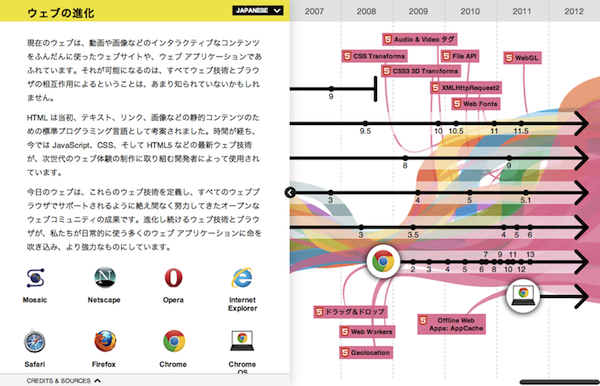</a>

## History of HTML

<table>
  <tr> <th>Year <th>Spec      <th>Topic
  <tr> <td>1993 <td>HTML 1.0  <td>IETF標準化
  <tr> <td>1997 <td>HTML 3.2  <td>W3C勧告 W3Cではじめての勧告
  <tr> <td>1997 <td>HTML 4.0  <td>W3C勧告
  <tr> <td>1999 <td>HTML 4.0.1<td>W3C勧告
  <tr> <td>2000 <td>XHTML 1.0 <td>W3C勧告 HTML 4.0.1をXMLで再定義
</table>

## History of HTML

<table>
  <tr> <th>Year <th>Spec      <th>Topic
  <tr> <td>2001 <td>XHTML 1.1 <td>W3C勧告 機能をモジュール化
  <tr> <td>2007 <td>HTML5     <td>W3Cで検討開始(WG設立)
  <tr> <td>2009 <td>XHTML 2.0 <td>XHTML2 WG 活動停止
  <tr> <td>2011 <td>HTML5     <td>W3C 最終草案
  <tr> <td>2012 <td>HTML5     <td>W3C 勧告候補 (2012/12/17)
  <tr> <td>2013 <td>HTML 5.1  <td>W3C WD (2013/05/28)
</table>

## W3C 仕様策定の流れ

* 作業草稿（Working Draft, WD） 
HTML 5.1 WD(<a href="http://www.w3.org/TR/2013/WD-html51-20130528/" target="_blank">2013/05/28</a>)
* 最終草案（Last Call Working Draft）
* 勧告候補（Candidate Recommendation, CR） 
HTML5 CR(<a href="http://www.w3.org/TR/2012/CR-html5-20121217/" target="_blank">2012/12/17</a>)
* 勧告案（Proposed Recommendation, PR）
* W3C勧告（W3C Recommendation, REC）

<small class='source'>
  <a href="http://ja.wikipedia.org/wiki/World_Wide_Web_Consortium" target="_blank">World Wide Web Consortium - Wikipedia</a> 
  <a href="http://ja.wikipedia.org/wiki/W3C%E5%8B%A7%E5%91%8A" target="_blank">W3C勧告 - Wikipedia</a>
</small>

# Sites using HTML5

## Sites using HTML5

すてきなデモは、前回の白石さんの資料を御覧ください。

<iframe src="http://www.slideshare.net/slideshow/embed_code/24481298" width="597" height="486" frameborder="0" marginwidth="0" marginheight="0" scrolling="no" style="border:1px solid #CCC;border-width:1px 1px 0;margin-bottom:5px" allowfullscreen webkitallowfullscreen mozallowfullscreen> </iframe>

<small class='source'>
<strong> <a href="http://www.slideshare.net/shumpei/html5forbeginners" title="HTML5 for Beginners" target="_blank">HTML5 for Beginners</a> </strong> from <strong><a href="http://www.slideshare.net/shumpei" target="_blank">Shumpei Shiraishi</a></strong>
</small>

## Sites using HTML5 - Apple

<small class='source'>
  <a href="http://www.apple.com/" target="_blank">Apple</a>
</small>

## Sites using HTML5 - Apple

* HTML5 Markup
* Custom Data Attribute
* Role Attribute
* CSS3
* Web Storage
* SVG
* data URL

## Sites using HTML5 - Apple

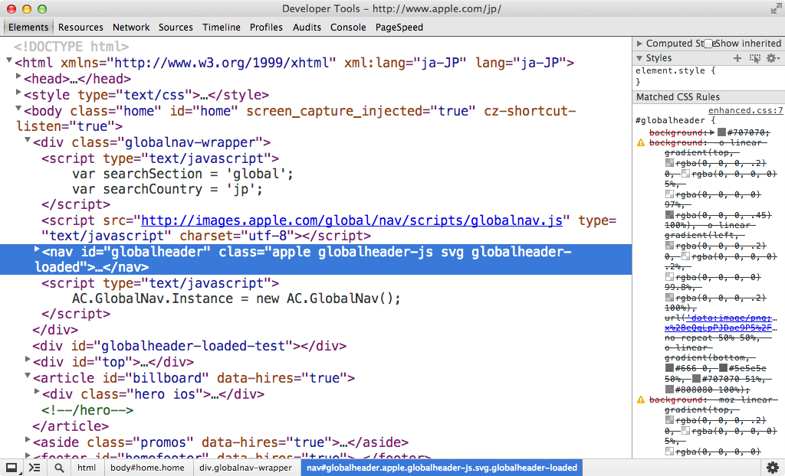

## Sites using HTML5 - Apple

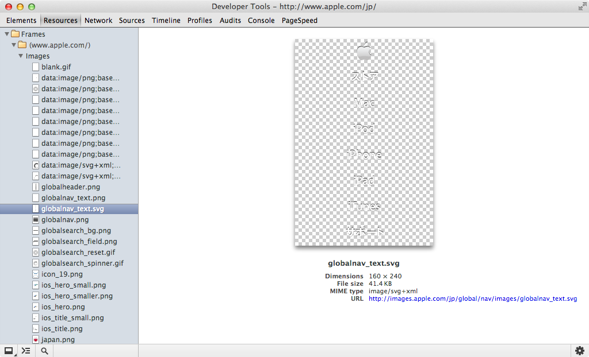

## Sites using HTML5 - Apple

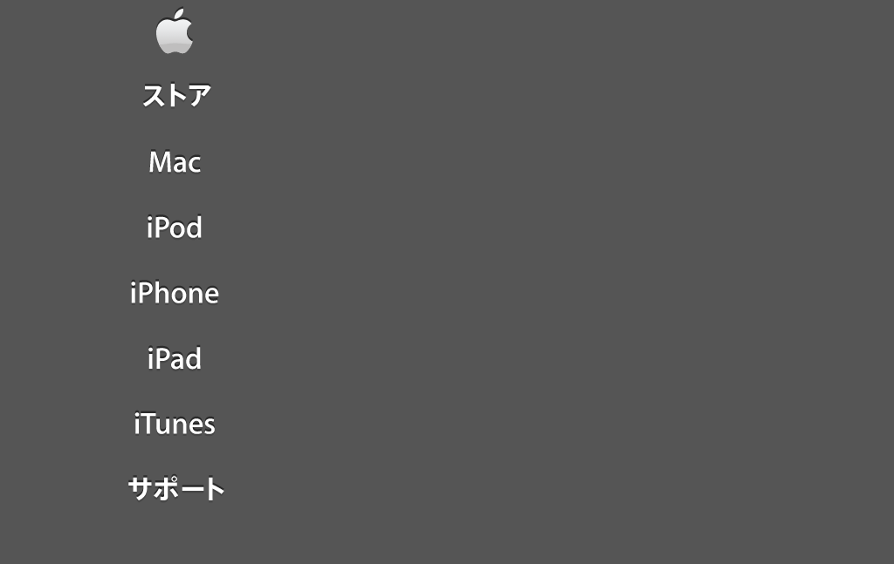

## Sites using HTML5 - Apple

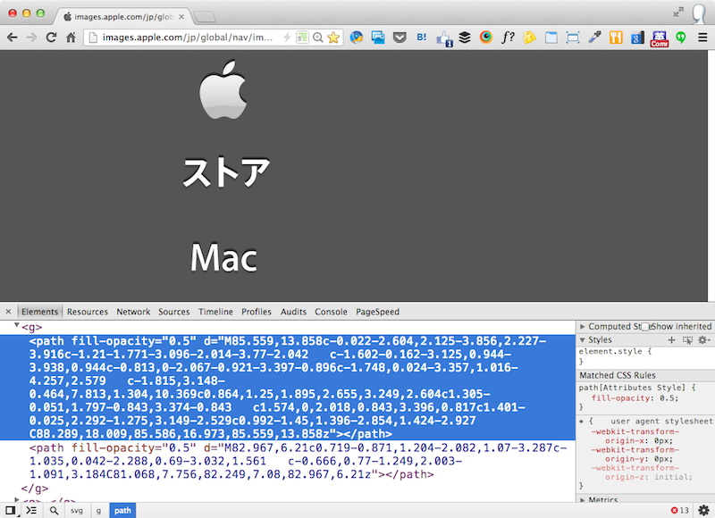

## Sites using HTML5 - Apple

SVG、みてみましょう

## Sites using HTML5 - Apple

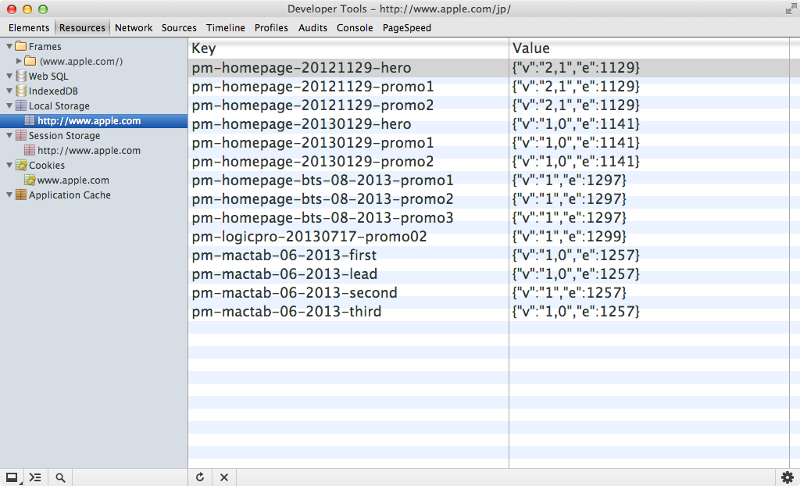

## Sites using HTML5 - Microsoft

<small class='source'>
  <a href="http://www.microsoft.com/ja-jp/default.aspx" target="_blank">Microsoft Japan</a>
</small>

## Sites using HTML5 - Microsoft

* HTML5 Markup
* Custom Data Attribute
* Role Attribute
* CSS3
* MediaQueries
* WebFonts

## Sites using HTML5 - Microsoft

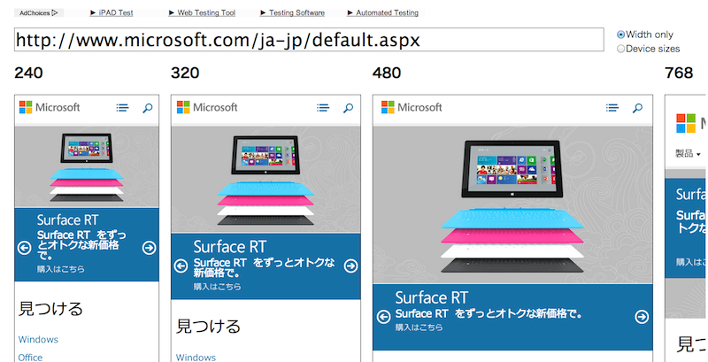

## Sites using HTML5 - Microsoft

サイズを変えて、みてみましょう。

## Sites using HTML5 - Microsoft

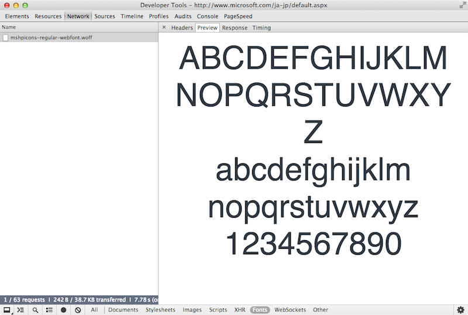

## Sites using HTML5 - Microsoft

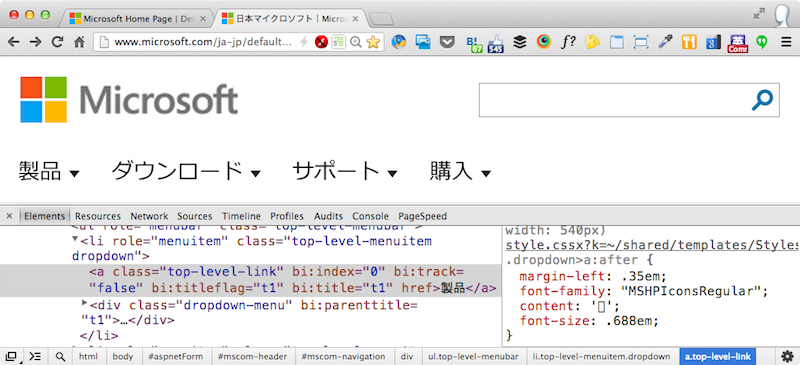

## Sites using HTML5 - Microsoft

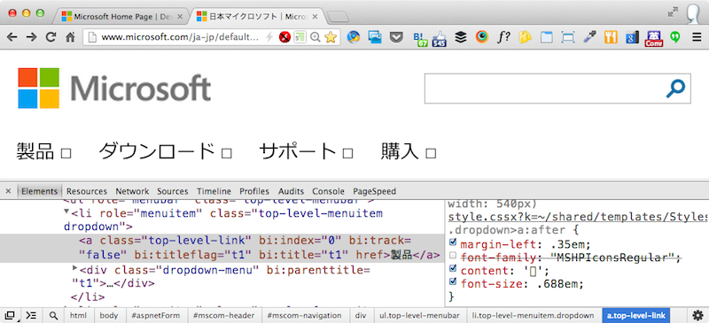

## Sites using HTML5 - Tabelog

<a href="http://tabelog.com/" target="_blank">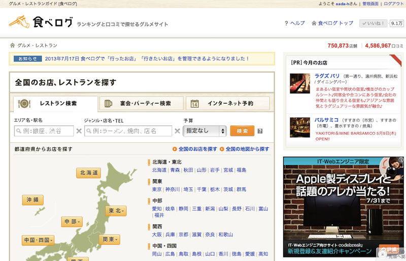</a>

<small class='source'>
  <a href="http://tabelog.com/" target="_blank">食べログ</a>
</small>

## Sites using HTML5 - Tabelog

* Rich Snippets(RDFa/Microdata)
* Custom Data Attribute
* CSS3

## Sites using HTML5 - Tabelog

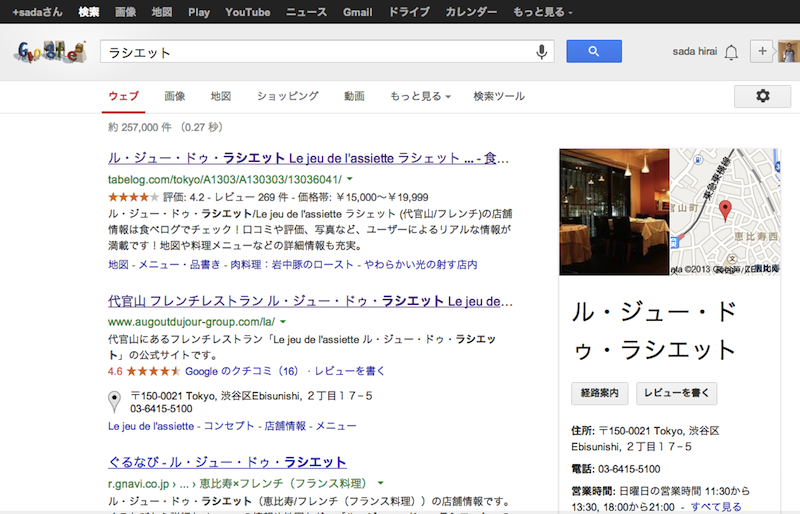

## Sites using HTML5 - Tabelog

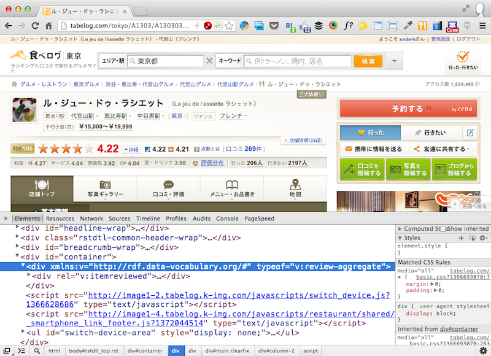

## Sites using HTML5 - Tabelog

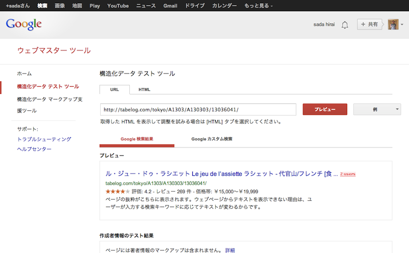

<small class='source'>
  <a href="http://www.google.com/webmasters/tools/richsnippets?q=http%3A%2F%2Ftabelog.com%2Ftokyo%2FA1303%2FA130303%2F13036041%2F" target="_blank">Google Structured Data Testing Tool</a>
</small>

# まとめ

HTML5 や HTML5に関連した技術、たくさんある。

すぐには必要のない技術かもしれない。

**どんな技術があるか知っておく** ことは大切。

ところで

僕も **初心者** だった。

はじめて参加した **HTML5とか勉強会** は 
**2010年12月** だった。

それから1年くらい連続で参加して 
毎回ブログを書いたり。

HTML5が楽しかった。 
仕事では使っていなかったけど 
楽しかったから、**調べた**、**勉強した**。

LTの募集があったので 
応募してLTしたり。

2012年1月から、<a href="http://html5j.org" target="_blank">html5j</a>のスタッフに。

いまの主な仕事はRubyのプログラミングだけど 
時間を作って、仕事のサービスを HTML5 にしたり。

いろんな技術があるから 
**興味の持てるもの** が 
あるんじゃないかな。

## The End

初めてのHTML5 - なにができるの？

HTML5とか勉強会 for ビギナー (第2回)

Thank you so mach.

**Enjoy HTML5!**

<a href="http://bit.ly/b5j2_1" target="_blank">http://bit.ly/b5j2_1</a>

<a href="http://twitter.com/sada_h" target="_blank">@sada_h</a>

